# Farrid Eka Putra

## 🚀 About Me

Highly experienced software engineer with over 11 years of expertise in
developing full-stack applications, with a strong focus on backend
development. Adept at utilizing the Django framework and proficient in
various programming languages and technologies. Known for a keen ability to
design, develop, and maintain scalable, efficient, and secure software
solutions.

## Education

- Bachelor's degree, Computer Science, IT faculty, Budi Luhur University Jakarta (2010-2015)

## Links

## Skills

- **Programming languages**
  - Python - Django : 6+ years
  - Dart - Flutter : 5+ years
  - Golang - Fiber : 1+ year
  - JavaScript (6+ years), SQL (8+ years), CSS (8+ years), HTML (8+ years)
- **Databases**
  - PostgreSQL, Oracle, MySQL, Redis
- **Tools**
  - Visual Studio Code, Postman, Docker, Keycloak, Android Studio, xCode, MS Visual Studio
- **Languages**
  - Indonesian (Native), English (B1-B2 proficiency)

## Work Experiences

## 1. PT. Nawastra Teknologi Nimpuna (09/2013 - 12/2024) - 11 years

    Jakarta - Senior Software Engineer - Fulltime - Hybrid

### Projects

1. PUSKEU POLRI / National Police of Indonesia (01/2024 ‒ 12/2024)
   - Developed financial application systems from requirements gathering to deployment.
   - Implemented Single-Sign-On (SSO) authorization using Keycloak.
   - Created APIs for frontend requirements and developed UI layouts for web applications.
   - Maintained and extended applications for enhanced functionality and performance
   - **Tech Stack :** Python (Django), Keycloak, Oracle, jQuery, CSS, Flutter
   - **URL :** https://app.puskeu.polri.go.id/

---

2. BAPPENAS: National Development Planning Agency of Indonesia (06/2023 ‒ 12/2023)
   - Maintained and extended existing web applications.
   - Developed and implemented APIs for mobile applications.
   - Identified, tracked, and resolved application defects.
   - **Tech Stack :** Python (Django), PostgreSQL, jQuery, CSS, Flutter
   - **URL :** https://myseed.id

---

3. AMYTHAS - BAPPENAS: Indonesia Software Company (06/2022 ‒ 12/2022)
   - Extended and maintained existing web applications.
   - Developed APIs for new mobile applications.
   - **Tech Stack :** Python (Django), PostgreSQL, jQuery, CSS, Flutter
   - **URL :** https://myseed.id

---

4. Lolab Indonesia: Indonesia Startup Company (01/2021 ‒ 05/2023)
   - Managed all phases of software development, including requirements, design, development, testing, implementation, and support.
   - Developed APIs and mobile applications for order and scheduling management.
   - Build and release apps to Play Store and App Store.
   - **Tech Stack :** Python (Django), PostgreSQL, jQuery, CSS, Flutter, xCode
   - **URL :** https://lolab.id

---

5. PUSKEU POLRI / National Police of Indonesia (01/2020 ‒ 06/2021)
   - Created financial application systems and dashboards for management reporting.
   - Developed new web applications and mobile apps using Flutter.
   - **Tech Stack :** Python (Django), PostgreSQL, jQuery, CSS, Flutter, Dundas
   - **URL :** https://app.puskeu.polri.go.id/

## Screenshots

### Puskeu POLRI

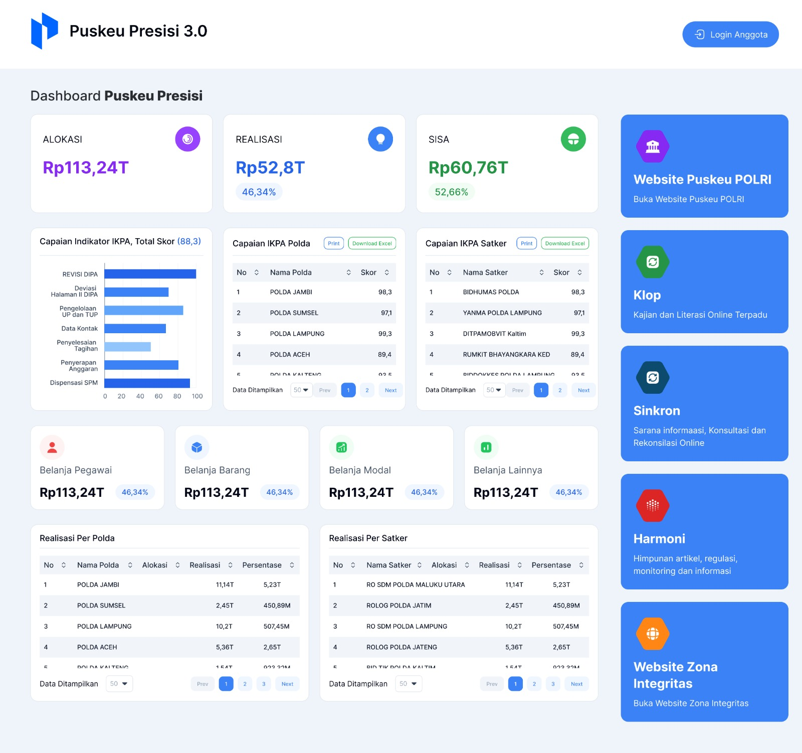  
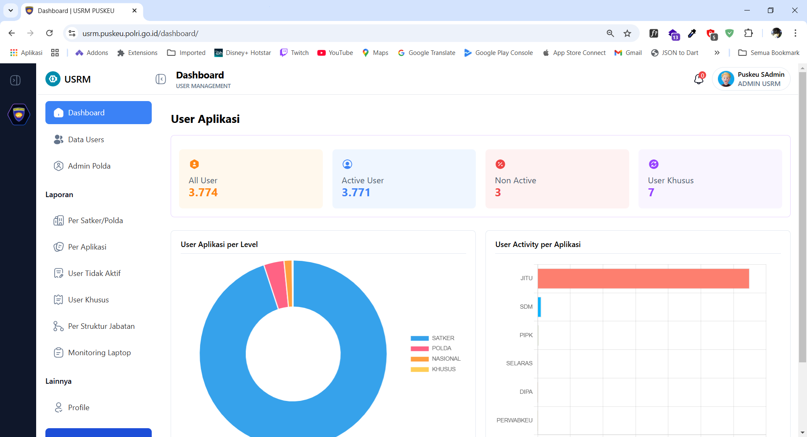  
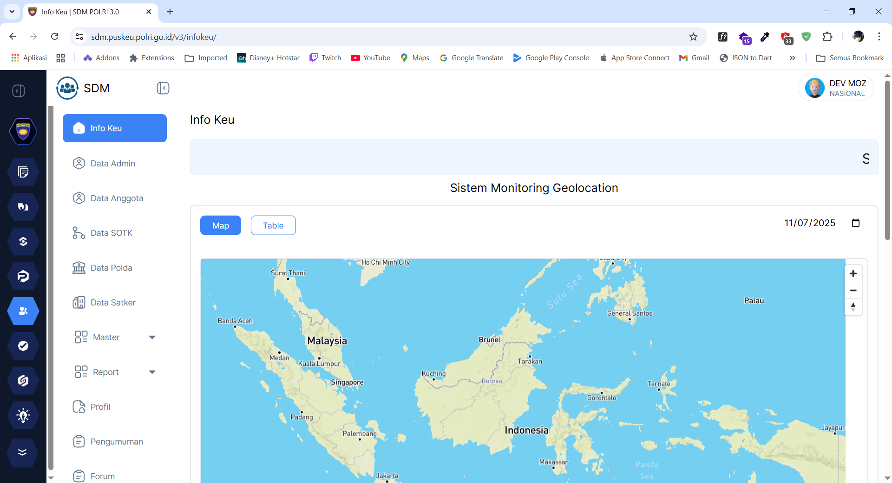
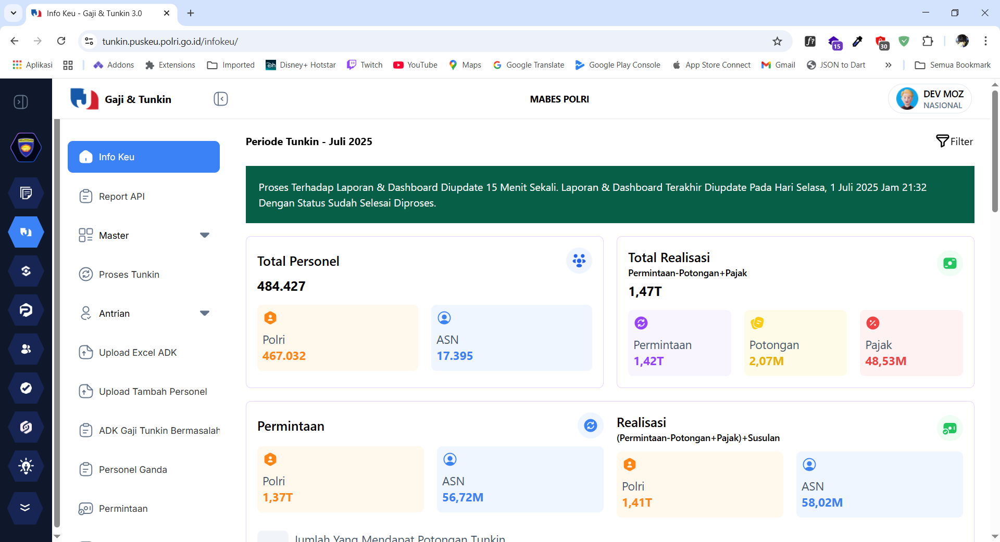
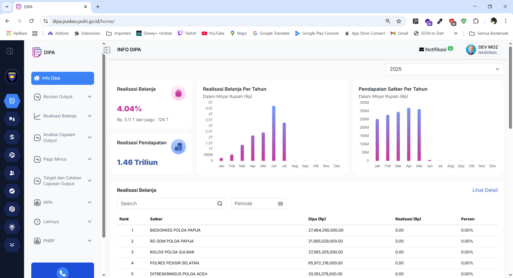
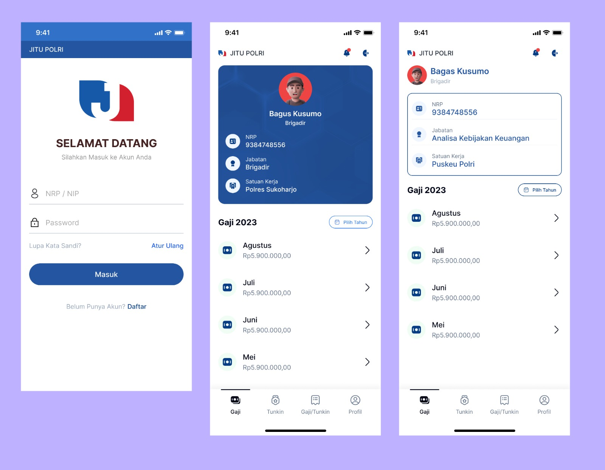

---

## 2. PT. Truku Indonesia (01/2020 - 12/2022) - 3 years

    Jakarta - Mobile Developer - Freelance - Remote

### Projects

1. Truku Indonesia (01/2020 - 12/2021)

   - Brand: Truku
   - Design and develop mobile application for Driver, Transporter, and Customer using Flutter Framework.
   - **Tech Stack :** Flutter
   - **URL :** https://truku.id/

2. Locus (01/2022 - 12/2022)
   - Brand: Locus
   - Design and develop mobile application for Driver, Transporter, and Customer using Flutter Framework.
   - **Tech Stack :** Flutter

## Screenshots

### Truku

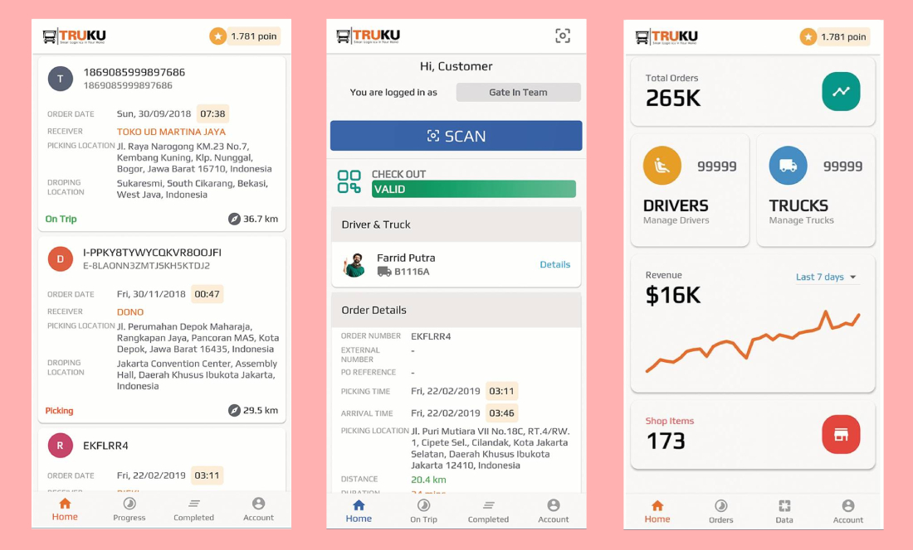

---

## 3. Pekerja Migran Indonesia (04/2025) - 1 month

    Jakarta - Mobile Developer - Freelance - Remote

- Design and develop prototype mobile application for Pekerja Migran Indonesia.
- **Tech Stack :** Flutter

## Screenshots

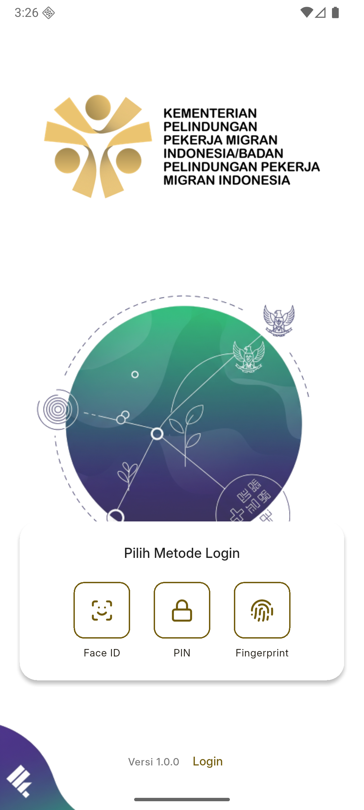
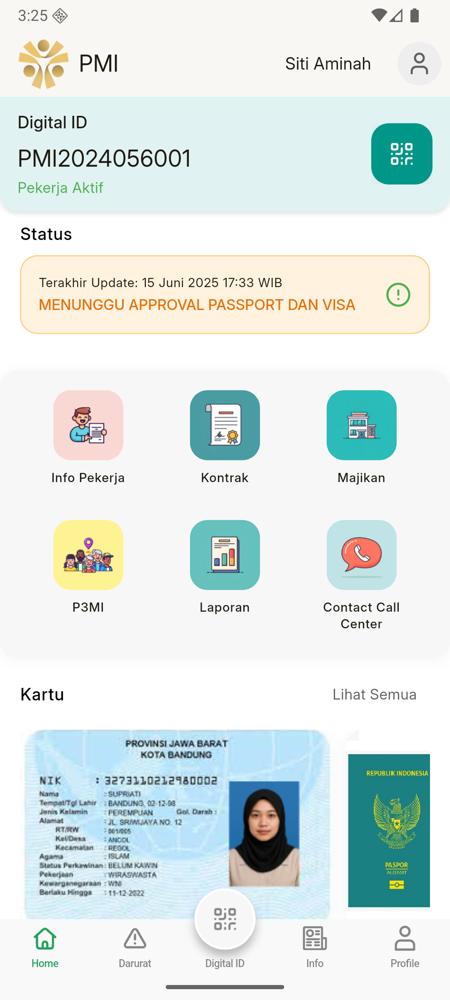
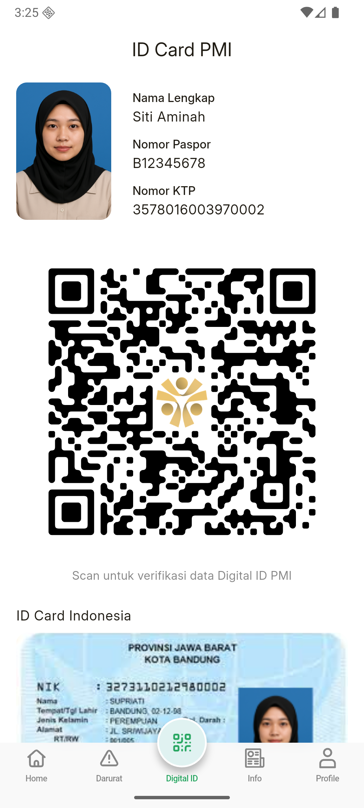

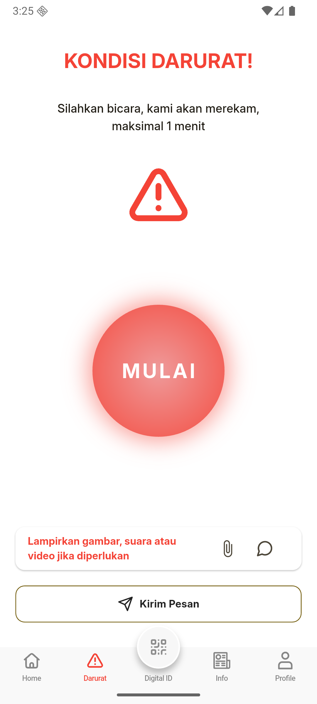
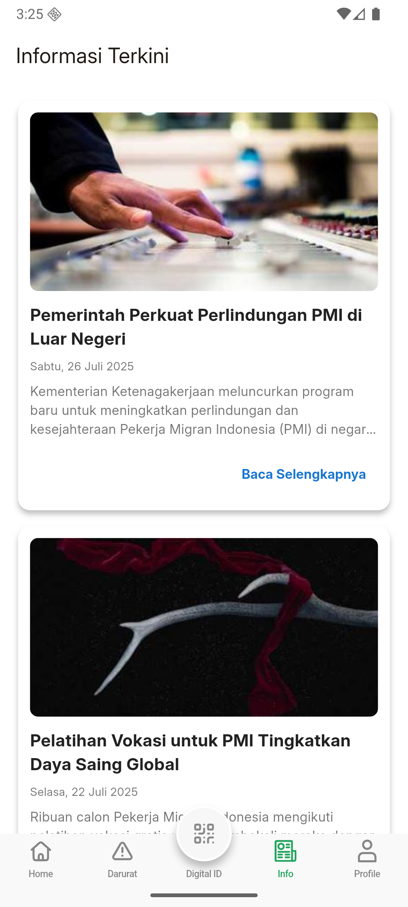
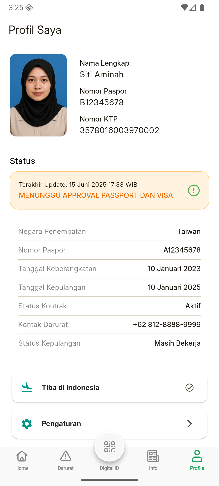

---

## 4. Omni App Solution Pte Ltd (05/2025) - 1 month

    Singapore - Backend Developer - Freelance - Remote

- Migrate the current backend application from Django 4.2.1 to Django 5.2.1.
- Perform unit testing to ensure that all functions are working properly.
- **Tech Stack :** Python (Django)
- **URL :** https://omniappsolutions.com/

---

## 5. PT. Truku Indonesia (06/2025 - now)

    Jakarta - Mobile Developer - Freelance - Remote

### Projects

1. Buma Group (06/2025 - now)

   - Brand: Buma
   - Build and release Driver, Transporter and Smart Fleet iOS application to App Store.
   - **Tech Stack :** Flutter, xCode
   - **URL :** https://truku.id/

## Screenshots

### Buma Driver

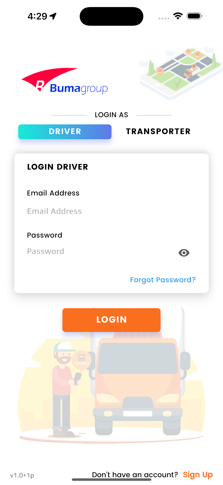
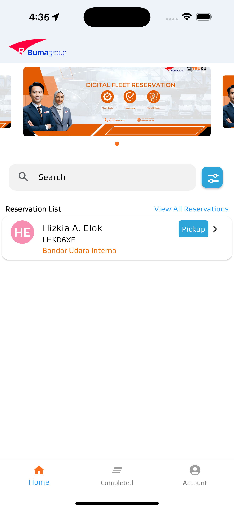
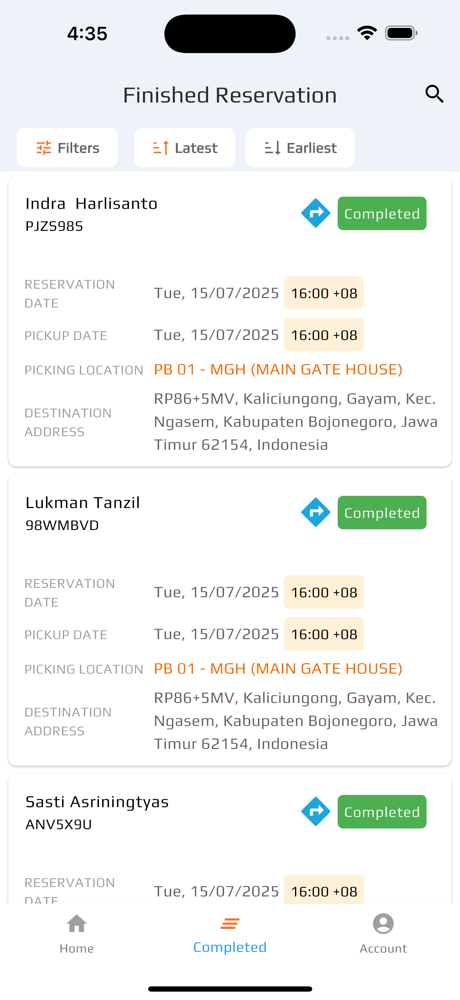

### Buma Smart Fleet

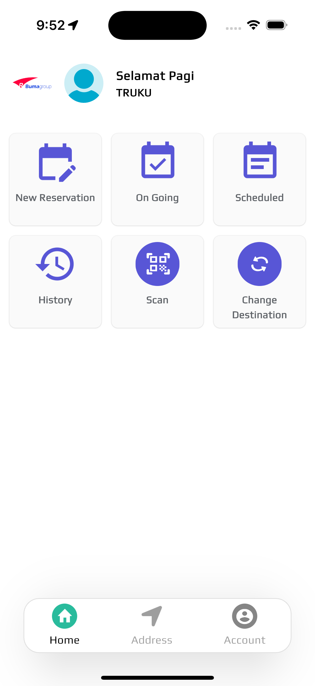

## Feedback

If you have any feedback, please contact me at farridputra@gmail.com
